# Dokumentasi Alur Program — LedgerFlow

> Dokumen ini berisi **flowchart alur program LedgerFlow** end-to-end dalam format **Mermaid**
> (render otomatis di GitHub/GitLab, VS Code, atau mermaid.live).
>
> Sumber: `README.md` + implementasi aktual di
> `backend/src/routes/*`, `backend/src/index.ts`, `backend/src/ai/*`,
> `frontend/src/App.tsx`, `frontend/src/context/AuthContext.tsx`,
> `frontend/src/hooks/useSubscription.ts`, dan `frontend/src/components/ProtectedFeature.tsx`.

---

## Cara Melihat Flowchart

Beberapa versi isi yang sama — pilih sesuai kebutuhan:

| Versi | File | Cara lihat |
|---|---|---|
| **Pratinjau .drawio** (persis seperti tampilan di draw.io) | `docs/flowchart/drawio/NN-*.png` | Buka gambarnya. Ini hasil render **viewer resmi draw.io**, jadi yang kamu lihat = yang muncul di app.diagrams.net. |
| **PNG / SVG dari Mermaid** | `docs/flowchart/NN-*.png` dan `NN-*.svg` | Langsung buka file gambarnya — tidak perlu install apa pun, bisa ditempel ke chat/Word/Slack. |
| **Gambar .drawio** (praktis, bisa diedit & digeser) | `DOKUMENTASI_FLOWCHART.drawio` | Buka **https://app.diagrams.net** → *Open Existing Diagram* → pilih file ini. Atau install ekstensi VS Code **Draw.io Integration** (`hediet.vscode-drawio`) lalu klik file-nya. |
| **Mermaid** (text, gampang di-diff) | `DOKUMENTASI_FLOWCHART.md` (file ini) | Render otomatis di GitHub/GitLab, atau tempel ke https://mermaid.live |

File `.drawio` berisi **16 halaman** (satu halaman per alur di bawah) — pindah halaman lewat tab di bagian bawah editor draw.io. Ekspor ke PNG/SVG/PDF dari menu *File → Export as*.

### Notasi

| Bentuk | Arti |
|---|---|
| Kotak biru | Langkah/proses |
| Belah ketupat kuning | Keputusan (percabangan) |
| Oval hijau | Mulai / selesai |
| Silinder ungu | Database / penyimpanan |
| Kotak merah | Jalur gagal / ditolak (4xx, 5xx, "Tolak") |
| Garis abu-abu | Alur maju |
| **Garis oranye putus-putus** | **Alur kembali ke atas** (retry / cooldown / validasi ulang) — keluar dari sisi atas node, memutar lewat jalur khusus di kanan, lalu masuk lagi dari atas |
| Garis abu-abu putus-putus | Panggilan eksternal / webhook |
| Lengkungan kecil di persilangan garis | *Line jump* — penanda bahwa dua garis saling menyilang, bukan bertemu |

Setiap panah punya **titik sambung sendiri** di sisi node (tidak ada dua panah yang menempel di titik yang sama), dan semua garis dibuat **siku-siku** (tidak menyerong). Jalan mendatar selalu jatuh di celah antar-baris yang kosong, jadi tidak ada garis yang menembus kotak node.

**Regenerate semua turunannya** setelah diagram Mermaid diubah:

```bash
npm run flowchart               # .drawio + gambar PNG/SVG dari Mermaid
npm run flowchart:drawio-render # pratinjau .drawio + verifikasi tata letak
npm run flowchart:check         # verifikasi kesesuaian isi
```

Atau satu per satu:

| Perintah | Hasil |
|---|---|
| `node scripts/mermaid-to-drawio.mjs` | `DOKUMENTASI_FLOWCHART.drawio` (16 halaman) |
| `node scripts/render-mermaid.mjs` | `docs/flowchart/NN-*.svg` + `NN-*.png` (16 gambar, dari sumber Mermaid) |
| `node scripts/check-render.mjs` | Laporan angka: jumlah node/panah/subgraph cocok dengan `.drawio`, tidak ada kotak bertumpuk, tidak ada label kosong |
| `node scripts/render-drawio.mjs` | `docs/flowchart/drawio/NN-*.svg` + `NN-*.png` (16 pratinjau `.drawio`) **+ laporan verifikasi tata letak** |
| `node scripts/render-drawio-ascii.mjs <file> <halaman>` | Pratinjau `.drawio` sebagai ASCII di terminal |

### Cara tata letak `.drawio` diverifikasi

`scripts/render-drawio.mjs` membuka file `.drawio` di **viewer resmi draw.io** (`viewer-static.min.js`)
di dalam Chrome headless, lalu **mengukur jalur panah yang benar-benar digambar draw.io** —
bukan geometri perkiraan script pembuatnya. Tiap halaman diperiksa untuk:

| Pemeriksaan | Arti |
|---|---|
| node bertumpuk | dua kotak node saling menimpa |
| panah miring | ruas panah tidak siku-siku |
| panah menembus node | garis melewati kotak node yang bukan ujungnya |
| label keluar | teks keluar dari kotak node-nya |
| PNG kosong | gambar hasil ekspor tidak berisi apa-apa |

Frame subgraph dikecualikan dari pemeriksaan "menembus": panah masuk/keluar frame memang melewati
garisnya. Kolom **titik-ganda** dilaporkan terpisah dan bukan kegagalan — itu titik tambahan yang
router draw.io sisipkan sendiri, tidak terlihat di gambar.

Renderer memakai **Chrome yang sudah terpasang** di komputer (lewat `@mermaid-js/mermaid-cli` +
`puppeteer`), jadi tidak perlu mengunduh Chromium lagi. Karena itu pula `.cache/viewer.min.js`
(viewer draw.io, diunduh sekali) sudah masuk `.gitignore`.

Render 16 gambar dari Mermaid butuh ~4 menit, dan 16 pratinjau `.drawio` ~3 menit.

---

## Daftar Isi

1. [Arsitektur Sistem](#1-arsitektur-sistem)
2. [Alur Umum Program (End-to-End)](#2-alur-umum-program-end-to-end)
3. [Alur Routing & Route Guard](#3-alur-routing--route-guard)
4. [Alur Autentikasi WhatsApp OTP](#4-alur-autentikasi-whatsapp-otp)
5. [Alur Login Google (OAuth)](#5-alur-login-google-oauth)
6. [Alur Onboarding Pengguna Baru](#6-alur-onboarding-pengguna-baru)
7. [Alur Chart of Accounts (COA)](#7-alur-chart-of-accounts-coa)
8. [Alur Input Jurnal sampai Posting](#8-alur-input-jurnal-sampai-posting)
9. [Alur Buku Besar](#9-alur-buku-besar)
10. [Alur Laporan Keuangan & Export](#10-alur-laporan-keuangan--export)
11. [Alur Manajemen Periode](#11-alur-manajemen-periode)
12. [Alur Manajemen User & RBAC](#12-alur-manajemen-user--rbac)
13. [Alur Subscription & Pembayaran (Midtrans)](#13-alur-subscription--pembayaran-midtrans)
14. [Alur AI CFO Assistant (LangGraph)](#14-alur-ai-cfo-assistant-langgraph)
15. [Alur Request Backend (Middleware Pipeline)](#15-alur-request-backend-middleware-pipeline)
16. [Alur Upload File (Avatar & Bukti Pembayaran)](#16-alur-upload-file-avatar--bukti-pembayaran)

---

## 1. Arsitektur Sistem

Alur data dari browser sampai database: React SPA → API layer (Axios) → Backend Hono →
Supabase, dengan layanan eksternal Fonnte (WhatsApp OTP), Midtrans (pembayaran), dan
OpenRouter (LLM AI CFO).

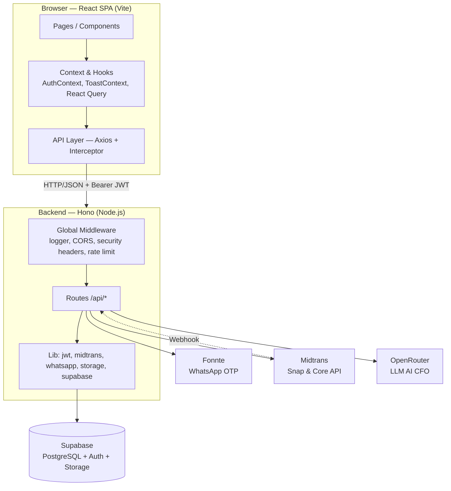

---

## 2. Alur Umum Program (End-to-End)

Dari membuka aplikasi, gerbang autentikasi, onboarding, penggunaan modul, sampai logout.

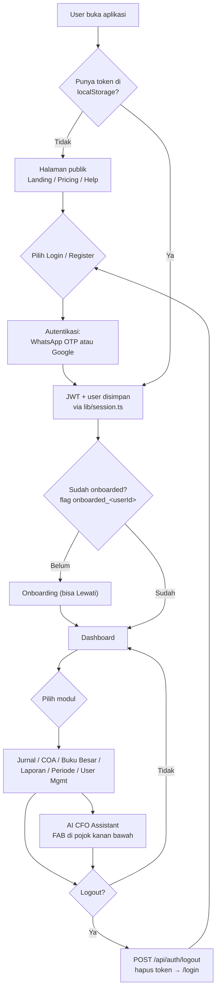

---

## 3. Alur Routing & Route Guard

Setiap route melewati guard bertingkat: **PublicRoute**, **ProtectedRoute**, **RoleRoute**,
dan **ProtectedFeature** (gerbang subscription). Role tidak berhak → `/error/403`.

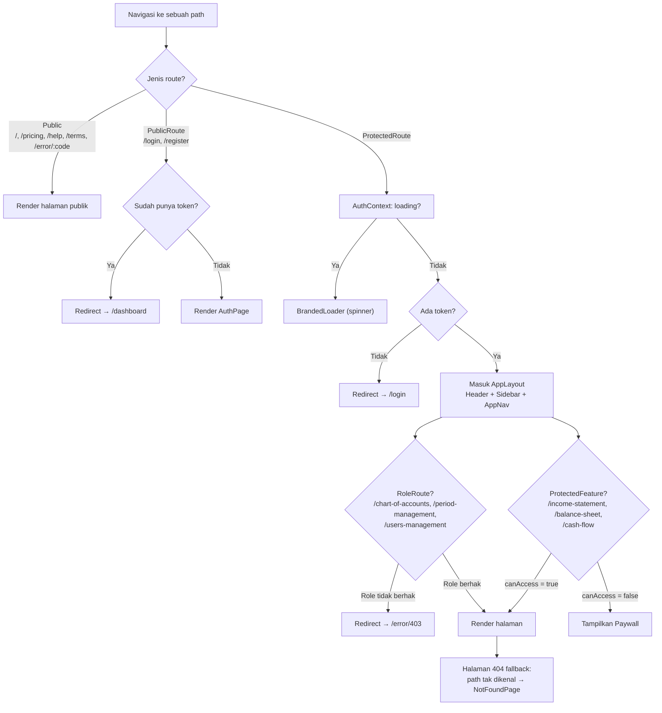

> Catatan: `/onboarding` berada di `ProtectedRoute`; `/auth/callback`, `/portal-akses`,
> dan `/admin-portal` berdiri di luar guard standar (admin portal hanya bisa dicapai
> lewat shortcut rahasia di `/login`).

---

## 4. Alur Autentikasi WhatsApp OTP

Metode login/register utama (passwordless). OTP dikirim lewat Fonnte; kode **tidak pernah**
dikembalikan ke client.

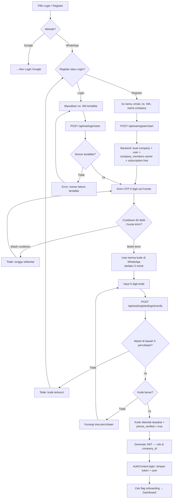

---

## 5. Alur Login Google (OAuth)

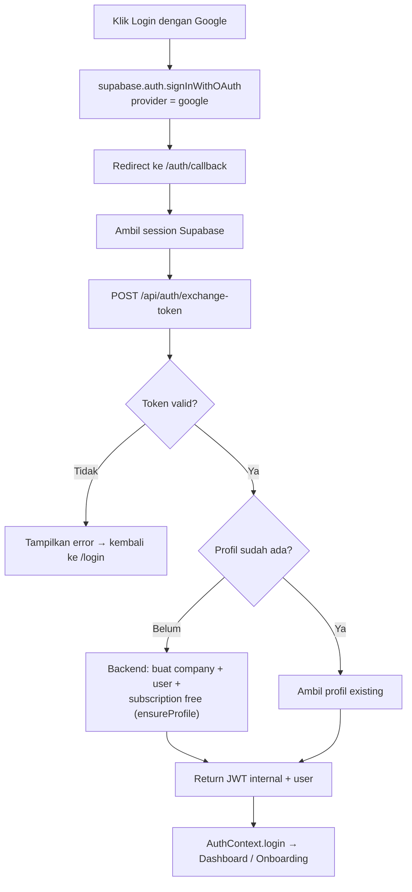

---

## 6. Alur Onboarding Pengguna Baru

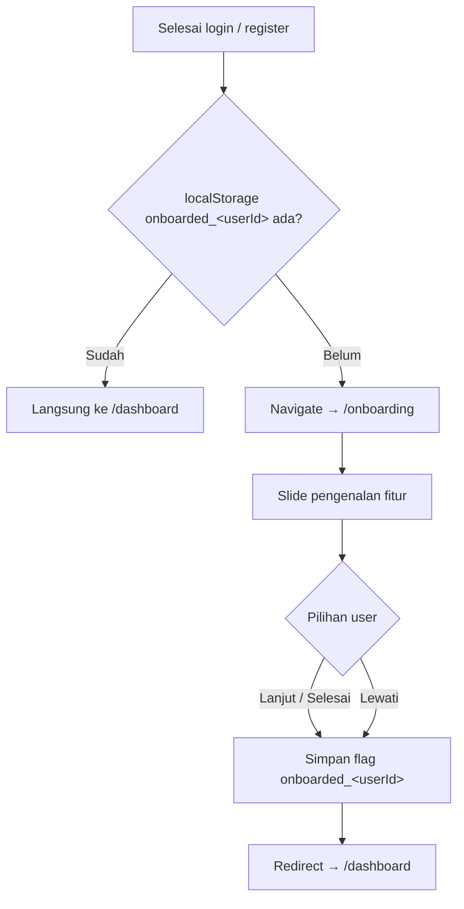

> Logout **tidak** menghapus flag `onboarded_*` dan `theme` — onboarding cukup sekali per user.

---

## 7. Alur Chart of Accounts (COA)

CRUD akun dengan mapping tipe → `normal_balance`, hierarki `parent_id`, dan **soft delete**.

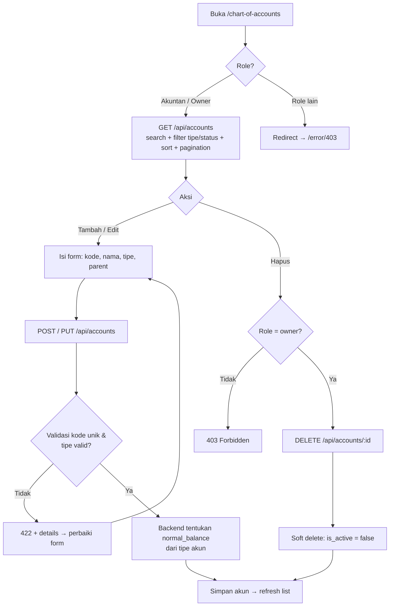

---

## 8. Alur Input Jurnal sampai Posting

Double-entry: validasi debit = kredit, cek periode open, kuota plan Free, lalu posting
agar masuk Buku Besar & Laporan.

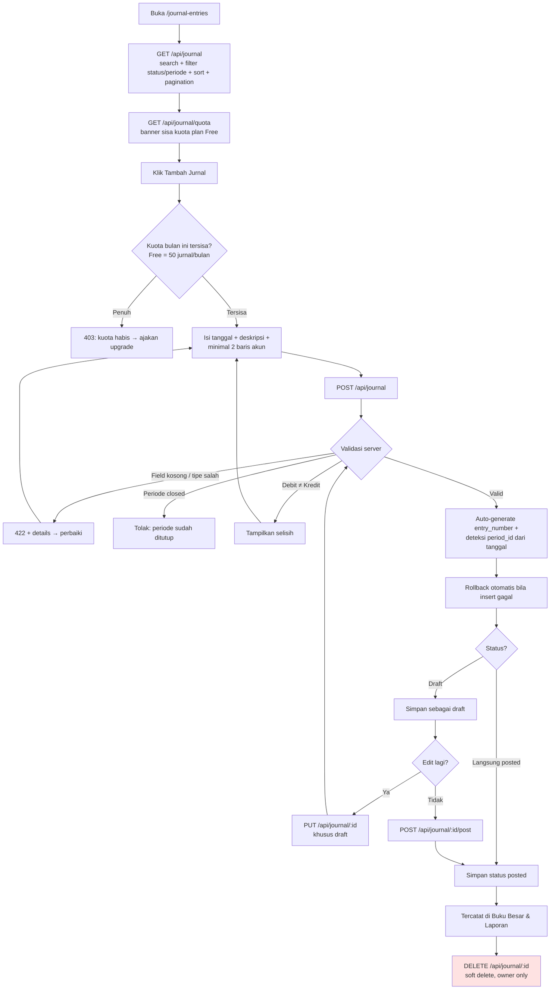

---

## 9. Alur Buku Besar

Menampilkan mutasi per akun dengan **saldo awal** dari jurnal posted sebelum periode,
plus running balance.

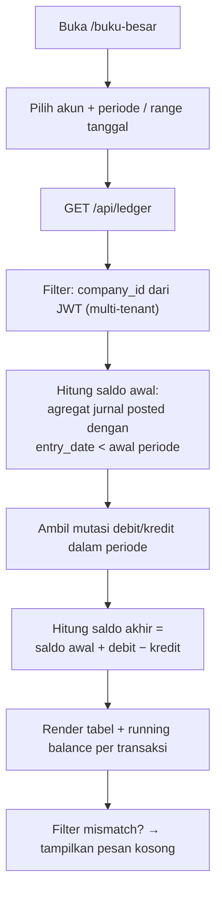

> Arah saldo mengikuti `normal_balance` akun: Debit = D−C, Kredit = C−D.

---

## 10. Alur Laporan Keuangan & Export

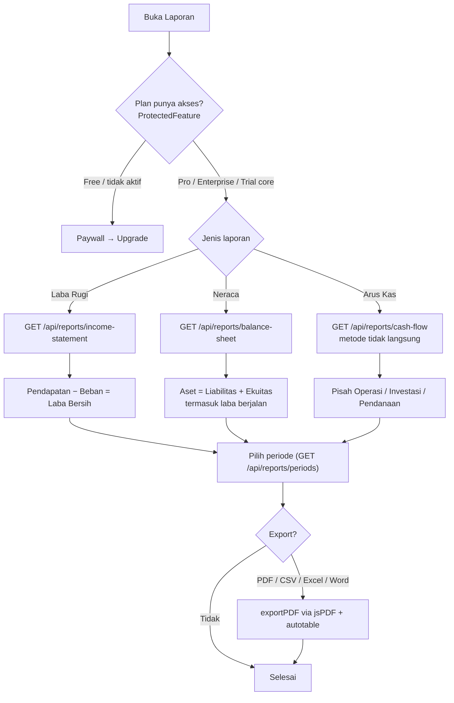

---

## 11. Alur Manajemen Periode

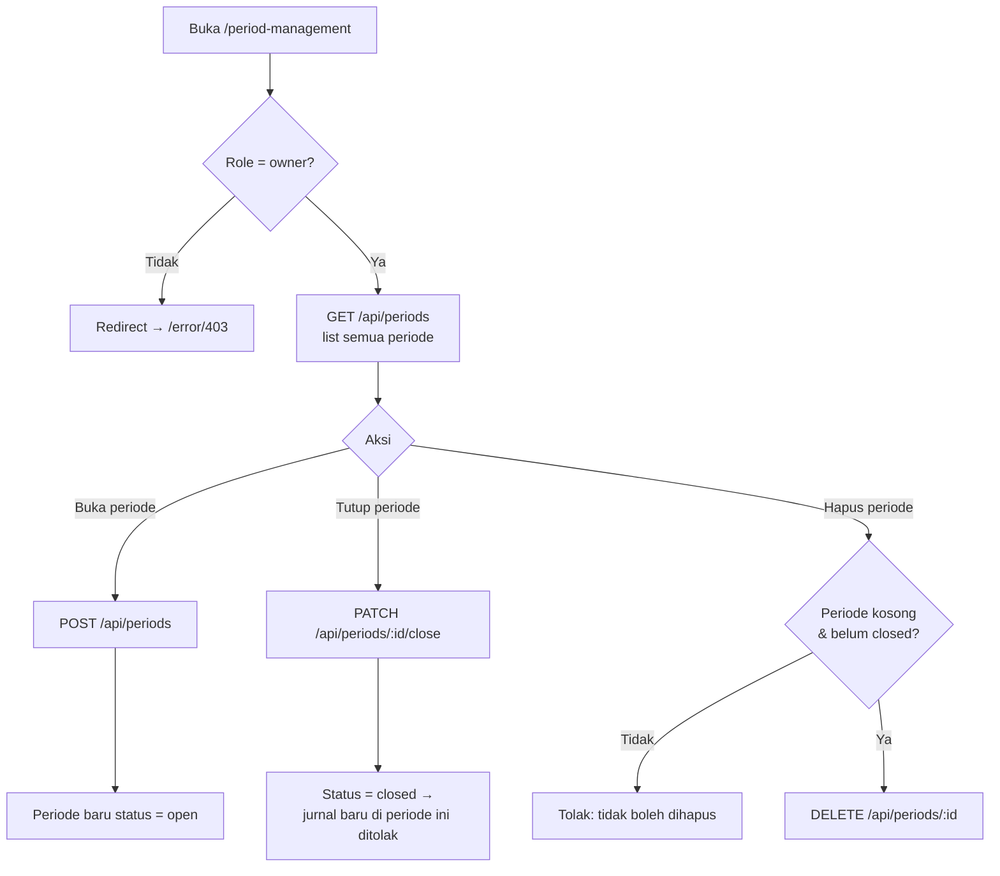

---

## 12. Alur Manajemen User & RBAC

RBAC per company: **owner** (akses penuh) dan **akuntan** (fokus pencatatan).

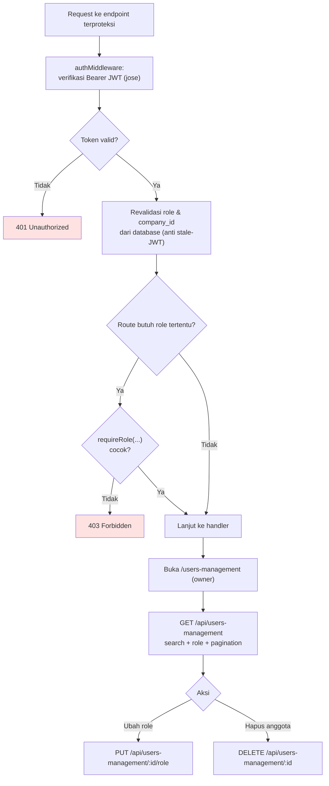

---

## 13. Alur Subscription & Pembayaran (Midtrans)

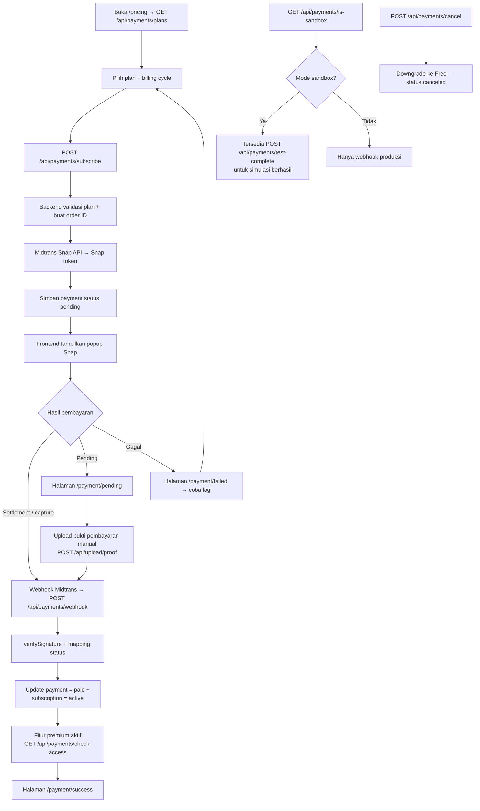

---

## 14. Alur AI CFO Assistant (LangGraph)

Router heuristik (tanpa biaya LLM tambahan) memilih agent spesialis; `company_id` di-bind
ke tools dari JWT, bukan dari state graph.

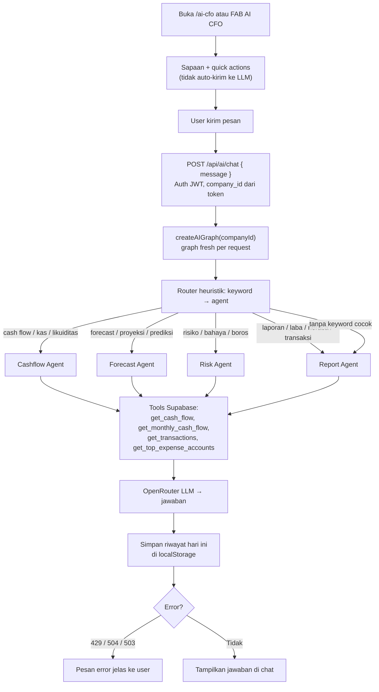

---

## 15. Alur Request Backend (Middleware Pipeline)

Urutan middleware global dan penanganan error konsisten di `backend/src/index.ts`.

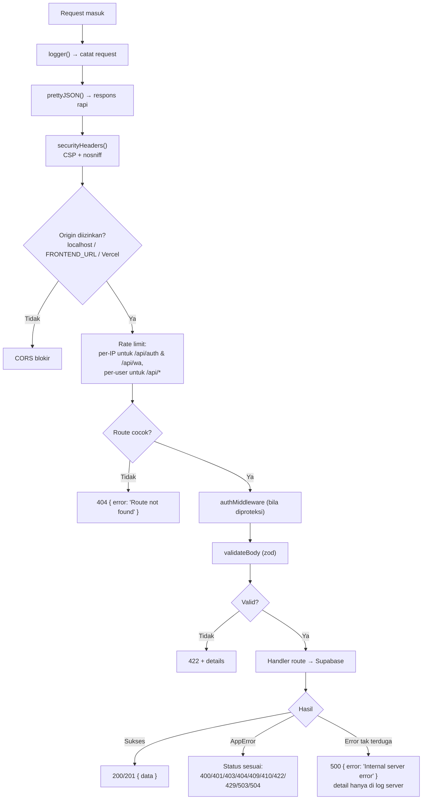

---

## 16. Alur Upload File (Avatar & Bukti Pembayaran)

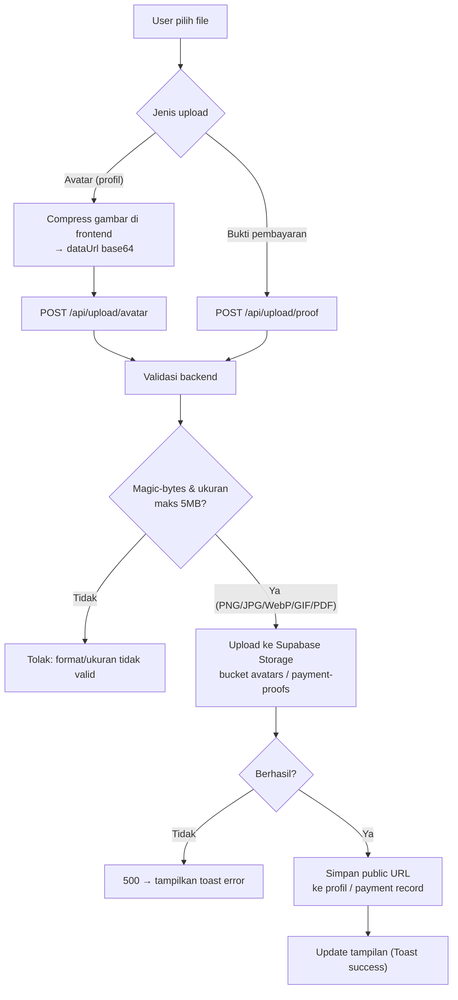

---

## Ringkasan Endpoint per Alur

| Alur | Endpoint Utama |
|---|---|
| Auth WhatsApp OTP | `POST /api/wa/{register,login}/{start,verify}` |
| Auth Google | `POST /api/auth/exchange-token` · `POST /api/auth/logout` |
| COA | `GET/POST/PUT/DELETE /api/accounts` |
| Jurnal | `GET/POST/PUT/DELETE /api/journal` · `POST /api/journal/:id/post` · `GET /api/journal/quota` |
| Buku Besar | `GET /api/ledger` |
| Laporan | `GET /api/reports/{income-statement,balance-sheet,cash-flow,periods}` |
| Periode | `GET/POST /api/periods` · `PATCH /api/periods/:id/close` · `DELETE /api/periods/:id` |
| User Management | `GET /api/users-management` · `PUT /api/users-management/:id/role` · `DELETE /api/users-management/:id` |
| Pembayaran | `GET /api/payments/plans` · `POST /api/payments/subscribe` · `POST /api/payments/webhook` · `POST /api/payments/cancel` |
| AI CFO | `POST /api/ai/chat` |
| Upload | `POST /api/upload/avatar` · `POST /api/upload/proof` |
| Sistem | `GET /health` |
