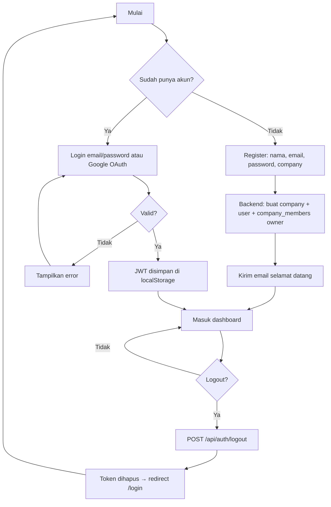
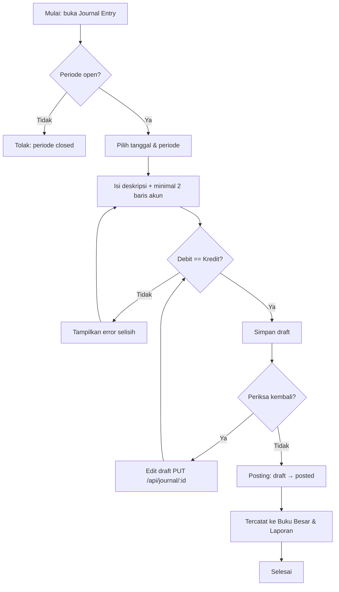
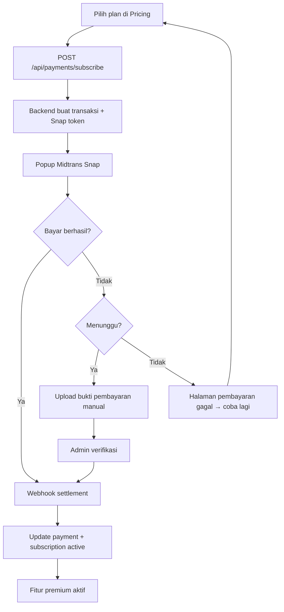

# LedgerFlow

**LedgerFlow** adalah aplikasi akuntansi dan pembukuan berbasis web modern yang dirancang untuk membantu usaha mengelola keuangan secara digital. Aplikasi ini mendukung pencatatan jurnal, buku besar, laporan keuangan (Laba Rugi, Neraca, Arus Kas), chart of accounts, manajemen periode, multi-perusahaan, autentikasi via **WhatsApp OTP** (Fonnte), AI CFO Assistant, serta sistem subscription dan pembayaran terintegrasi.

---

## Daftar Isi

- [✅ Checklist Kepatuhan Ketentuan Projekan S1](#-checklist-kepatuhan-ketentuan-projekan-s1)
- [Tech Stack](#tech-stack)
- [Arsitektur Aplikasi](#arsitektur-aplikasi)
- [Struktur Proyek](#struktur-proyek)
- [Backend](#backend)
- [Frontend](#frontend)
- [Database](#database)
- [API Endpoints](#api-endpoints)
- [Cara Menjalankan](#cara-menjalankan)
- [Fitur Detail](#fitur-detail)
- [Akun Demo](#akun-demo)
- [Dokumentasi Perancangan Sistem (Flowchart)](#dokumentasi-perancangan-sistem-flowchart)

---

## ✅ Checklist Kepatuhan Ketentuan Projekan S1

> Legend: ✅ Sudah sesuai · ⚠️ Sebagian / perlu dicek ulang · ❌ Belum ada, wajib dikerjakan.
> Update status ini setiap kali kamu menambal salah satu poin.

### FRONTEND

| # | Ketentuan | Status | Catatan / TODO |
|---|---|---|---|
| 1 | Responsive layout (mobile/tablet/desktop) | ⚠️ | Bottom Navigation mobile (tab + bottom sheet) & drawer terpasang; belum diverifikasi tiap halaman utama bebas overflow di 3 breakpoint |
| 2 | Auth flow: Login, Register, Logout, **Forgot Password**, **Reset Password** | ✅ | Semua halaman ada: Login, Register, ForgotPassword, ResetPassword, Logout via menu user |
| 2a | JWT disimpan di Local Storage/Cookie | ✅ | Token & user disimpan di `localStorage` via `AuthContext` |
| 3 | Routing: Public, Private, **Role Route**, redirect jika tanpa akses | ✅ | `PublicRoute`, `ProtectedRoute`, `RoleRoute` (owner/akuntan) — redirect ke `/dashboard` bila role tidak berhak |
| 4 | Dashboard real-time (card summary, total data, statistik, aktivitas terbaru) | ✅ | `useDashboardData` + `DashboardPage` |
| 5 | CRUD Interface lengkap (List/Detail/Tambah/Edit/Hapus) per data utama | ⚠️ | Chart of Accounts & Journal lengkap (list/detail/form edit/hapus). Modul lain read-only sesuai sifatnya |
| 6 | Search, Filter (status/kategori/tanggal), Sorting (terbaru/terlama/A-Z/Z-A), bisa dipakai bersamaan | ✅ | Chart of Accounts (search + filter tipe/status), Journal (search + filter status), Buku Besar (filter akun/range tanggal) |
| 7 | Pagination (prev/next/nomor halaman/jumlah data/items-per-page) | ✅ | `usePagination` + `TablePagination` dipasang di Chart of Accounts, Journal, Dashboard (10 item/halaman default) |
| 8 | Upload file (gambar/PDF) | ✅ | Avatar profil (compress → Supabase Storage) + bukti pembayaran di halaman hasil pembayaran |
| 9 | Form validation realtime (required, min/max karakter, email, no. telp, konfirmasi password) | ✅ | Validasi per-field realtime (onChange/onBlur) di Login, Register, Forgot/Reset Password, Profile (`utils/validation.ts`) |
| 10 | Notification (success/error/warning/info) via Toast | ✅ | `ToastContext` + `ToastContainer` |
| 11 | Halaman error 401/403/404/500 + fallback API gagal | ✅ | `NotFoundPage` (404), `ErrorPage` (404/401/403/500), fallback error di semua halaman list |

### BACKEND

| # | Ketentuan | Status | Catatan / TODO |
|---|---|---|---|
| 1 | REST API standar (GET/POST/PUT/PATCH/DELETE) + status code sesuai | ✅ | Konsisten: 400/401/403/404/409/422/500 sesuai kasus |
| 2 | Register, Login, **Logout**, Refresh Token (opsional), **Forgot Password**, **Reset Password** | ✅ | `/logout` (audit), `/forgot-password`, `/reset-password`, plus WhatsApp OTP (`/api/wa/{register,login}/{start,verify}`) |
| 3 | RBAC minimal 2 role, hak akses beda | ✅ | Per company: owner & akuntan via `requireRole`; admin aplikasi (pemilik aplikasi) lewat gerbang terpisah, read-only + moderasi |
| 4 | CRUD lengkap (C/R/U/D) di minimal 6 entitas utama, tidak boleh dummy | ✅ | Full CRUD: `accounts`, `journal` (incl. PUT & soft-delete), `periods` (incl. DELETE), `users`, `users-management`, `subscriptions` |
| 5 | Server-side validation (required/email/unique/min/max/enum/numeric/date), error JSON | ✅ | Validasi manual + error handler global JSON di semua route POST/PUT |
| 6 | Upload file (gambar/PDF) di backend | ✅ | `POST /api/upload/avatar` & `/api/upload/proof` → Supabase Storage (bucket `avatars`, `payment-proofs`) |
| 7 | Global error handling 400/401/403/404/422/500, format response konsisten | ✅ | Error handler global di `index.ts` + `c.json({ error })` konsisten |
| 8 | DB relationship: 6 tabel utama, 5 relasi, wajib ada 1:1, 1:M, M:1, **M:M** | ✅ | M:M via junction `company_members` (users ↔ companies) |
| 9 | Soft delete minimal 2 tabel | ✅ | `accounts` (`is_active`) + `journal_entries` (`deleted_at`) |
| 10 | API Documentation (Swagger/OpenAPI/Postman Collection) | ✅ | `postman/ledgerflow.postman_collection.json` (10 folder, 40+ request, auto-save token) |
| 11 | Security: Password Hashing, JWT, CORS, Request Validation, SQL Injection Prevention, (XSS = nilai tambah) | ✅ | Password via Supabase Auth (argon/bcrypt), JWT (jose), CORS whitelist, Supabase SDK (parameterized query), validasi di tiap route |
| 12 | Search, Filter, Sorting, Pagination di endpoint list (`?search=&status=&sort=&page=`) | ✅ | Konsisten di `accounts`, `journal`, `users-management` → `{ data, total, page, limit }` |

### DATABASE

| # | Ketentuan | Status | Catatan / TODO |
|---|---|---|---|
| 1 | Minimal 6 tabel utama | ✅ | 11 tabel (`companies`, `users`, `accounts`, `periods`, `journal_entries`, `journal_entry_lines`, `plans`, `subscriptions`, `payments`, `wa_otp_codes`, `company_members`) |
| 2 | Minimal 5 relasi antar tabel | ✅ | Terpenuhi (1:1, 1:M, M:1, M:M) |
| 3 | Primary Key & Foreign Key | ✅ | Terpenuhi |
| 4 | Normalisasi minimal 3NF | ✅ | Struktur sudah cukup ternormalisasi |
| 5 | Timestamp `created_at` & `updated_at` di **setiap** tabel utama | ✅ | Trigger `set_updated_at` di 6 tabel utama (companies, users, accounts, periods, journal_entries, journal_entry_lines) |
| 6 | Soft delete minimal 2 tabel | ✅ | `accounts` (`is_active`) + `journal_entries` (`deleted_at`) |
| 7 | Seed data minimal 20 data/tabel utama | ✅ | `npm run seed` (backend): 2 user, 26 akun, 12 periode, 54 jurnal + lines, company & members |

### TATA CARA PENGUMPULAN

| # | Ketentuan | Status | Catatan / TODO |
|---|---|---|---|
| 1 | Fullstack FE + BE dalam 1 repo (monorepo) | ✅ | Struktur sudah monorepo |
| 2 | Repository GitHub public | ⚠️ | Perlu dipastikan visibility repo = Public |
| 3 | README berisi: judul, deskripsi, fitur utama, teknologi, struktur folder, cara instalasi | ✅ | Sudah lengkap di README ini |
| 4 | Akun demo (jika diperlukan) | ✅ | Seed `npm run seed` — lihat [Akun Demo](#akun-demo) |
| 5 | Dokumentasi perancangan sistem berupa Flowchart | ✅ | Flowchart Mermaid di [Dokumentasi Perancangan Sistem](#dokumentasi-perancangan-sistem-flowchart) |

---

## Tech Stack

### Backend

| Teknologi | Kegunaan |
|---|---|
| **Hono** | Framework web TypeScript ringan untuk API REST |
| **Supabase** | Database dan backend service |
| **Fonnte** | WhatsApp Gateway untuk OTP autentikasi (WA) |
| **Midtrans** | Payment gateway |
| **Google Auth** | OAuth 2.0 login |
| **LangGraph.js + LangChain** | AI CFO Assistant (agent router + tools) |
| **OpenRouter** | Provider LLM (model gratis `:free`) |

### Frontend

| Teknologi | Kegunaan |
|---|---|
| **React** | Library UI |
| **TypeScript** | Type safety |
| **Vite** | Build tool |
| **Tailwind CSS** | CSS framework |
| **React Router** | Client-side routing |
| **TanStack React Query** | Data fetching |
| **Axios** | HTTP client |
| **Recharts** | Chart library |
| **Framer Motion** | Animasi UI |


---

## Arsitektur Aplikasi

```
┌─────────────────────────────────────────────────────┐
│                    Browser                           │
│  ┌───────────────────────────────────────────────┐  │
│  │              React SPA (Vite)                  │  │
│  │  ┌─────────┐ ┌──────────┐ ┌───────────────┐  │  │
│  │  │  Pages  │ │Components│ │  Context/Hooks │  │  │
│  │  └────┬────┘ └────┬─────┘ └───────┬───────┘  │  │
│  │       └───────────┼───────────────┘           │  │
│  │                   ▼                           │  │
│  │           ┌──────────────┐                    │  │
│  │           │  API Layer   │ (Axios + interceptor)│  │
│  │           └──────┬───────┘                    │  │
│  └──────────────────┼────────────────────────────┘  │
└─────────────────────┼───────────────────────────────┘
                      │ HTTP/JSON
                      ▼
┌─────────────────────────────────────────────────────┐
│               Backend (Hono)                         │
│  ┌──────────┐ ┌──────────┐ ┌────────────────────┐  │
│  │  Routes  │ │Middleware│ │  Lib (JWT, Midtrans)│  │
│  └────┬─────┘ └──────────┘ └────────┬───────────┘  │
│       │                             │               │
│       └─────────────┬───────────────┘               │
│                     ▼                               │
│            ┌────────────────┐                       │
│            │  Supabase SDK  │                       │
│            └────────┬───────┘                       │
└─────────────────────┼───────────────────────────────┘
                      │
                      ▼
            ┌─────────────────────┐
            │  Supabase Platform  │
            │  ┌───────────────┐  │
            │  │  PostgreSQL   │  │
            │  │  + RLS        │  │
            │  └───────────────┘  │
            │  ┌───────────────┐  │
            │  │  Auth Service │  │
            │  └───────────────┘  │
            └─────────────────────┘

Payment Flow:
  Frontend → Backend POST /subscribe
           → Midtrans Snap popup
           → User bayar
           → Midtrans Webhook → Backend → Supabase
```

---

## Struktur Proyek

```
LedgerFlow/
├── backend/
│   ├── src/
│   │   ├── index.ts                    # Entry point, route mounting, middleware global
│   │   ├── routes/
│   │   │   ├── auth.ts                 # Register, login, logout, exchange-token, Google OAuth
│   │   │   ├── wa-auth.ts              # Autentikasi WhatsApp OTP: register & login (start/verify)
│   │   │   ├── password-reset.ts       # Forgot & reset password via email link
│   │   │   ├── accounts.ts             # CRUD Chart of Accounts
│   │   │   ├── journal.ts              # CRUD Journal Entries + posting (soft delete, search, pagination)
│   │   │   ├── ledger.ts               # Buku Besar per akun
│   │   │   ├── reports.ts              # Laporan: Laba Rugi, Neraca, Arus Kas
│   │   │   ├── periods.ts             # Manajemen periode akuntansi (incl. DELETE)
│   │   │   ├── payments.ts            # Subscription & Midtrans payment flow
│   │   │   ├── users.ts               # Profil user
│   │   │   ├── user-management.ts     # Kelola anggota company + role (RBAC)
│   │   │   ├── upload.ts             # Upload avatar & bukti pembayaran ke Storage
│   │   │   ├── companies.ts           # Manajemen perusahaan
│   │   │   ├── health.ts              # Diagnostik SMTP / jaringan (owner)
│   │   │   └── ai.ts                  # POST /api/ai/chat — AI CFO
│   │   ├── ai/                         # LangGraph AI CFO Assistant
│   │   │   ├── graph/                  # StateGraph + router agent
│   │   │   ├── agents/                 # Cashflow, Forecast, Report, Risk
│   │   │   ├── tools/                  # Query Supabase (cashflow, transaksi, beban)
│   │   │   ├── prompts/                # System prompts per agent
│   │   │   └── models/provider.ts      # ChatOpenAI → OpenRouter
│   │   ├── lib/
│   │   │   ├── supabase.ts             # Supabase admin client
│   │   │   ├── jwt.ts                  # JWT sign & verify (jose)
│   │   │   ├── midtrans.ts            # Midtrans Snap, Core API, helpers
│   │   │   ├── email.ts               # SMTP email (welcome, login, reset)
│   │   │   ├── whatsapp.ts            # Kirim OTP WA via Fonnte (normalisasi nomor + kode)
│   │   │   ├── authClient.ts          # Supabase anon client (signIn dengan password)
│   │   │   ├── ensureProfile.ts       # Konsistensi profil user + company_members
│   │   │   ├── env.ts                 # loadEnv (.env) + warning OPENROUTER_*/FONNTE_*
│   │   │   └── storage.ts             # Upload base64 ke Supabase Storage
│   │   ├── middleware/
│   │   │   └── auth.ts                # Auth middleware + RBAC middleware
│   │   └── midtrans.d.ts             # Type definitions Midtrans
│   ├── scripts/
│   │   └── seed-demo.ts               # Seed data demo (npm run seed)
│   ├── .env                            # Environment variables backend
│   ├── package.json
│   └── tsconfig.json
├── frontend/
│   ├── src/
│   │   ├── main.tsx                    # Entry point React, provider wrapping
│   │   ├── App.tsx                     # Router, guards, layout, FAB AI CFO
│   │   ├── pages/                      # Halaman-halaman aplikasi
│   │   │   ├── HomePage.tsx            # Landing page
│   │   │   ├── LoginPage.tsx           # Login (email/password, Google OAuth, WhatsApp OTP)
│   │   │   ├── RegisterPage.tsx        # Register (email + verifikasi WhatsApp OTP)
│   │   │   ├── ForgotPasswordPage.tsx  # Lupa password
│   │   │   ├── ResetPasswordPage.tsx   # Reset password
│   │   │   ├── AuthCallback.tsx        # Google OAuth callback handler
│   │   │   ├── DashboardPage.tsx       # Dashboard utama
│   │   │   ├── ChartOfAccounts.tsx     # Chart of Accounts (CRUD + pagination)
│   │   │   ├── JournalEntryPage.tsx    # Jurnal entries (filter + pagination)
│   │   │   ├── BukuBesarPage.tsx       # Buku besar
│   │   │   ├── IncomeStatementPage.tsx # Laporan Laba Rugi
│   │   │   ├── BalanceSheet.tsx        # Neraca
│   │   │   ├── CashFlowPage.tsx        # Arus Kas
│   │   │   ├── PeriodManagement.tsx    # Manajemen periode
│   │   │   ├── UserManagementPage.tsx  # Kelola user & role anggota
│   │   │   ├── OnboardingPage.tsx      # Onboarding pertama kali login (bisa lewati)
│   │   │   ├── AiCfoPage.tsx           # AI CFO Assistant (chat + riwayat hari ini)
│   │   │   ├── PricingPage.tsx         # Halaman pricing & upgrade
│   │   │   ├── PaymentResultPage.tsx   # Hasil pembayaran + upload bukti
│   │   │   ├── ProfilePage.tsx         # Profil user (avatar upload) + aksi akun (Settings/Help/Logout)
│   │   │   ├── SettingsPage.tsx        # Settings
│   │   │   ├── HelpCenterPage.tsx      # Pusat bantuan
│   │   │   ├── PublicHelpPage.tsx      # Bantuan publik (tanpa login)
│   │   │   ├── ErrorPage.tsx          # Halaman error (401/403/404/500)
│   │   │   └── NotFoundPage.tsx       # Halaman 404
│   │   ├── data/                       # Single source of truth konfigurasi
│   │   │   ├── navigation.ts           # NAV_ITEMS, BOTTOM_NAV_IDS, flatten/get* (Sidebar, Drawer, BottomNav, QuickNav)
│   │   │   ├── quickNav.ts             # Re-export filterQuickNav (pencarian Header)
│   │   │   └── helpCenterContent.ts    # Konten halaman bantuan
│   │   ├── components/
│   │   │   ├── AppShell.tsx            # Layout utama (Header + Sidebar + Main + AppNav)
│   │   │   ├── AppNav.tsx              # Gerbang Bottom Navigation (hanya halaman utama aplikasi)
│   │   │   ├── BottomNav.tsx           # Bottom navigation mobile (tab + bottom sheet)
│   │   │   ├── BottomNavSheet.tsx      # Bottom sheet kategori (Accounts/Reports)
│   │   │   ├── AICfoFloatingButton.tsx # FAB AI CFO (pojok kanan bawah, naik di mobile)
│   │   │   ├── ai/                     # Komponen chat AI (bubble, welcome, history)
│   │   │   ├── Header.tsx              # Top navigation bar (search/quick nav)
│   │   │   ├── HeaderSearchResults.tsx # Hasil pencarian quick navigation
│   │   │   ├── Sidebar.tsx             # Sidebar navigasi (desktop + drawer mobile)
│   │   │   ├── Navbar.tsx              # Navbar responsif
│   │   │   ├── Footer.tsx              # Footer
│   │   │   ├── PageTransition.tsx      # Animasi transisi halaman
│   │   │   ├── ThemeSwitcher.tsx       # Dark/light mode toggle
│   │   │   ├── LogoMark.tsx            # Logo SVG
│   │   │   ├── AccountModal.tsx        # Modal tambah/edit akun
│   │   │   ├── AccountTable.tsx        # Tabel chart of accounts
│   │   │   ├── AccountShared.tsx       # Shared account utilities
│   │   │   ├── ExportMenu.tsx          # Menu export laporan (PDF/dll)
│   │   │   ├── journal/
│   │   │   │   ├── JournalForm.tsx     # Form input jurnal
│   │   │   │   ├── JournalList.tsx     # Daftar jurnal
│   │   │   │   ├── JournalDetail.tsx   # Detail jurnal
│   │   │   │   ├── JournalShared.tsx   # Shared journal utilities
│   │   │   │   ├── ConfirmDialog.tsx   # Dialog konfirmasi
│   │   │   ├── ledger/
│   │   │   │   ├── LedgerTable.tsx     # Tabel buku besar
│   │   │   │   ├── LedgerFilter.tsx    # Filter buku besar
│   │   │   │   └── LedgerShared.tsx    # Shared ledger utilities
│   │   │   ├── reports/
│   │   │   │   ├── BalanceSheetCard.tsx    # Kartu neraca
│   │   │   │   ├── BalanceSheetTable.tsx   # Tabel neraca
│   │   │   │   └── BalanceSheetStatus.tsx  # Status keseimbangan neraca
│   │   │   ├── CashFlowChart.tsx       # Chart arus kas
│   │   │   ├── TablePagination.tsx     # Pagination tabel
│   │   │   ├── InfoPanel.tsx           # Panel informasi
│   │   │   ├── HoverDropdown.tsx       # Dropdown hover
│   │   │   ├── ToastContainer.tsx      # Container notifikasi
│   │   │   ├── Paywall.tsx             # Paywall untuk fitur premium
│   │   │   └── ProtectedFeature.tsx    # Gate fitur berdasarkan subscription
│   │   ├── hooks/
│   │   │   ├── useAccounts.ts          # Data fetching akun
│   │   │   ├── useJournal.ts           # Data fetching jurnal
│   │   │   ├── useLedger.ts            # Data fetching buku besar
│   │   │   ├── useDashboardData.ts     # Data dashboard
│   │   │   ├── useIncomeStatement.ts   # Data laba rugi
│   │   │   ├── useCashFlow.ts          # Data arus kas
│   │   │   ├── useSubscription.ts      # Status subscription & akses fitur
│   │   │   └── usePagination.ts        # Hook pagination
│   │   ├── services/
│   │   │   ├── accountsService.ts      # API calls akun
│   │   │   ├── journalService.ts       # API calls jurnal
│   │   │   ├── ledgerService.ts        # API calls buku besar
│   │   │   ├── reportsService.ts       # API calls laporan
│   │   │   ├── periodsService.ts       # API calls periode
│   │   │   └── paymentService.ts       # API calls pembayaran
│   │   ├── context/
│   │   │   ├── AuthContext.tsx          # Context autentikasi (login, logout, register)
│   │   │   └── ToastContext.tsx         # Context notifikasi toast
│   │   ├── types/
│   │   │   ├── account.ts              # Tipe data akun
│   │   │   ├── journal.ts              # Tipe data jurnal
│   │   │   ├── ledger.ts               # Tipe data buku besar
│   │   │   ├── reports.ts              # Tipe data laporan
│   │   │   └── constants.ts            # Konstanta
│   │   ├── lib/
│   │   │   ├── api.ts                  # Axios instance + interceptors
│   │   │   ├── supabaseClient.ts       # Supabase client frontend
│   │   │   └── utils.ts               # Utility functions
│   │   └── utils/
│   │       ├── authHelpers.ts          # Helper autentikasi
│   │       ├── validation.ts           # Validasi form realtime
│   │       ├── currency.ts             # Format mata uang IDR
│   │       └── exportPDF.ts            # Export laporan ke PDF
│   ├── .env                            # Environment variables frontend
│   ├── index.html
│   ├── vite.config.ts
│   ├── tailwind.config.js
│   ├── postcss.config.js
│   ├── eslint.config.js
│   ├── vercel.json
│   ├── tsconfig.json
│   ├── tsconfig.app.json
│   └── tsconfig.node.json
├── database/
│   ├── database.sql                    # Full database schema & migrations (base)
│   ├── migration-wa-auth.sql           # Fungsi/tabel autentikasi WA (wa_otp_codes, users.phone)
│   └── migration-journal-rpc-and-email-verify.sql  # RPC jurnal & verifikasi email
├── postman/
│   └── ledgerflow.postman_collection.json  # Postman collection (API docs)
├── GOOGLE_OAUTH_SETUP.md               # Dokumentasi setup Google OAuth
├── .gitignore
├── package.json                        # Root workspace (concurrently)
└── README.md
```

---

## Backend

### Arsitektur Backend

Backend menggunakan **Hono**, framework web TypeScript ringan yang cepat dan memiliki ekosistem middleware yang baik. Server berjalan di Node.js via `@hono/node-server`.

### Entry Point (`backend/src/index.ts`)

File utama yang menginisialisasi aplikasi Hono dan melakukan:

1. **Global middleware** — Logger, CORS, error handler
2. **Route mounting** — Semua route di-mount di path `/api/*`
3. **Health check** — `GET /health` untuk monitoring

### Authentication System (`backend/src/routes/auth.ts` + `wa-auth.ts`)

Sistem autentikasi mendukung tiga metode:

1. **Register (`POST /api/auth/register`)** — Buat company, user, dan profil baru
2. **Login (`POST /api/auth/login`)** — Verifikasi kredensial dan generate token
3. **Exchange Token (`POST /api/auth/exchange-token`)** — Konversi token OAuth ke token aplikasi
4. **Logout (`POST /api/auth/logout`)** — Logout & audit log (JWT stateless, ini hanya pencatatan)
5. **WhatsApp OTP (`POST /api/wa/*`)** — Register & login tanpa password via kode OTP WhatsApp (lihat [WhatsApp OTP](#whatsapp-otp) di bawah)

### WhatsApp OTP (`backend/src/routes/wa-auth.ts` + `lib/whatsapp.ts`)

Autentikasi alternatif berbasis OTP WhatsApp (gateway **Fonnte**) untuk register & login:

- **`POST /register/start`** — Terima `{ name, email, password (opsional), phone }`, buat company + user + relasi `company_members`, lalu kirim OTP 6 digit ke WhatsApp
- **`POST /register/verify`** — Verifikasi kode → tandai `phone_verified`, generate JWT, sambungkan Otp ke akun
- **`POST /login/start`** — Terima `{ phone }`, kirim OTP untuk user yang sudah terdaftar
- **`POST /login/verify`** — Verifikasi kode dan login (token dikeluarkan)
- Cooldown 60 detik pengiriman, masa berlaku OTP 5 menit, max 5 percobaan → terkunci
- Kode OTP **tidak pernah dikirim balik** ke client — hanya lewat WhatsApp
- Normalisasi nomor ke format internasional (`62...`), status device Fonnte ikut dicek

### JWT System (`backend/src/lib/jwt.ts`)

- Library: **jose** untuk sign & verify token
- Token berisi data user dan company

### Auth Middleware (`backend/src/middleware/auth.ts`)

1. **`authMiddleware`** — Middleware utama:
   - Ekstrak dan verifikasi Bearer token dari header `Authorization`
   - Revalidasi role & `company_id` dari database setiap request (anti stale-JWT)
   - Simpan payload user ke context untuk digunakan di route handlers

2. **`requireRole(...roles)`** — Middleware untuk membatasi akses berdasarkan role user (per company: `owner` / `akuntan`)

### Supabase Client (`backend/src/lib/supabase.ts`)

- Satu instance global untuk operasi database
- Validasi environment variables sebelum inisialisasi

### Payment & Subscription System (`backend/src/routes/payments.ts`)

Sistem pembayaran terintegrasi dengan **Midtrans** (payment gateway Indonesia) dengan endpoint lengkap:

1. **`GET /plans`** — Ambil semua plan aktif (Free/Pro/Enterprise) untuk pricing page

2. **`GET /is-sandbox`** — Cek apakah mode sandbox (berguna untuk menampilkan tombol simulasi)

3. **`GET /subscription`** — Ambil data subscription user

4. **`POST /subscribe`** — Buat transaksi pembayaran:
   - Validasi plan
   - Buat transaksi di Midtrans Snap API
   - Simpan payment record
   - Return snap token ke frontend

5. **`POST /test-complete`** — Simulasi pembayaran berhasil (sandbox only)

6. **`POST /webhook`** — Midtrans webhook handler:
   - Verifikasi notifikasi dari Midtrans
   - Mapping status pembayaran
   - Update payment & subscription status
   - Return response ke Midtrans

7. **`GET /history`** — Riwayat pembayaran (20 transaksi terakhir)

8. **`POST /cancel`** — Cancel subscription (downgrade ke Free, status "canceled")

9. **`GET /check-access`** — Cek akses user ke fitur tertentu

### Midtrans Library (`backend/src/lib/midtrans.ts`)

- Konfigurasi Snap + Core API
- Helper untuk generate order ID
- Helper untuk verifikasi notifikasi webhook
- Konstanta harga subscription

### Chart of Accounts (`backend/src/routes/accounts.ts`)

- **`GET /`** — Ambil semua akun milik company (search/sort/pagination, urutan kode ascending)
- **`POST /`** — Buat akun baru (owner/akuntan):
  - Mapping tipe frontend ke enum database
  - Otomatis tentukan `normal_balance` dari tipe akun
  - Dukungan `parent_id` untuk hierarki akun
- **`PUT /:id`** — Update akun (owner/akuntan):
  - Mapping ulang tipe akun
  - Hapus field undefined agar tidak overwrite
  - Multi-tenant guard via `company_id`
- **`DELETE /:id`** — Soft delete (set `is_active: false`), owner only

### Journal Entries (`backend/src/routes/journal.ts`)

- **`GET /`** — List jurnal dengan `search` (no/deskripsi), `status`, `period_id`, `sort`, `page`, `limit` → `{ data, total, page, limit }`. Entry soft-delete (`deleted_at`) otomatis disembunyikan
- **`GET /:id`** — Detail satu jurnal (tidak menampilkan yang ter-soft delete)
- **`POST /`** — Buat jurnal baru (owner/akuntan only)
- **`PUT /:id`** — Edit jurnal **berstatus draft** (owner/akuntan):
  - Cek periode closed (ditolak)
  - Validasi saldo debit = kredit
  - Ganti seluruh lines via `accountCode` → `account_id`
- **`POST /:id/post`** — Posting jurnal (draft → posted)
- **`DELETE /:id`** — Hapus jurnal (owner only) — **soft delete** (set `deleted_at`), periode closed ditolak

### Upload & Storage (`backend/src/routes/upload.ts` + `lib/storage.ts`)

- **`POST /api/upload/avatar`** — Terima `{ dataUrl }` (base64), upload ke bucket `avatars`, simpan URL ke profil user
- **`POST /api/upload/proof`** — Upload bukti pembayaran ke bucket `payment-proofs` (folder `orders/{order_id}`) untuk demo

### Ledger / Buku Besar (`backend/src/routes/ledger.ts`)

- **`GET /`** — Tampilkan mutasi buku besar per akun dalam periode tertentu

### Reports (`backend/src/routes/reports.ts`)

1. **Income Statement (`GET /income-statement`)** — Laporan Laba Rugi
2. **Balance Sheet (`GET /balance-sheet`)** — Neraca
3. **Cash Flow (`GET /cash-flow`)** — Laporan Arus Kas (Metode Tidak Langsung)

4. **Periods (`GET /periods`)** — Ambil daftar periode untuk filter laporan

### Periods Management (`backend/src/routes/periods.ts`)

- **`GET /`** — List semua periode
- **`POST /`** — Buka periode baru
- **`PATCH /:id/close`** — Tutup periode

### Users (`backend/src/routes/users.ts`)

- **`GET /:id`** — Ambil profil user
- **`PUT /:id`** — Update profil user

---

## Frontend

### Arsitektur Frontend

Frontend adalah **Single Page Application (SPA)** menggunakan React 19 dengan Vite sebagai build tool. Data fetching dikelola oleh TanStack React Query dengan Axios sebagai HTTP client.

### Entry Point (`frontend/src/main.tsx`)

```
AuthProvider → ToastProvider → App
```

Provider wrapping:
- **AuthProvider**: menyediakan context autentikasi global
- **ToastProvider**: menyediakan context notifikasi
- **App**: router + query client provider

### Routing & Route Guards (`frontend/src/App.tsx`)

**Route Guards:**
- **`ProtectedRoute`** — Cek `token` dan `loading` dari `useAuth()`. Jika belum login, redirect ke `/login`. Menampilkan spinner saat loading.
- **`PublicRoute`** — Jika sudah login, redirect ke `/dashboard`.
- **`RoleRoute`** — Cek role user (`owner`/`akuntan`). Jika role tidak berhak, redirect ke `/dashboard`.

**Theme System:**
- Inisialisasi tema dari localStorage
- Support: light, dark, system (mendeteksi prefers-color-scheme)
- Listener perubahan tema sistem

**Route Structure:**
| Path | Halaman | Guard |
|---|---|---|
| `/` | HomePage | Public |
| `/login` | LoginPage | PublicRoute |
| `/register` | RegisterPage | PublicRoute |
| `/auth/callback` | AuthCallback | - |
| `/forgot-password` | ForgotPasswordPage | PublicRoute |
| `/reset-password` | ResetPasswordPage | - |
| `/onboarding` | OnboardingPage | ProtectedRoute |
| `/dashboard` | DashboardPage | ProtectedRoute |
| `/chart-of-accounts` | ChartOfAccounts | RoleRoute (owner/akuntan) |
| `/journal-entries` | JournalEntryPage | ProtectedRoute |
| `/buku-besar` | BukuBesarPage | ProtectedRoute |
| `/period-management` | PeriodManagement | RoleRoute (owner) |
| `/users-management` | UserManagementPage | RoleRoute (owner) |
| `/profile` | ProfilePage | ProtectedRoute |
| `/settings` | SettingsPage | ProtectedRoute |
| `/help-center` | HelpCenterPage | ProtectedRoute |
| `/income-statement` | IncomeStatementPage | ProtectedRoute + ProtectedFeature |
| `/balance-sheet` | BalanceSheet | ProtectedRoute + ProtectedFeature |
| `/cash-flow` | CashFlowPage | ProtectedRoute + ProtectedFeature |
| `/ai-cfo` | AiCfoPage | ProtectedRoute |
| `/pricing` | PricingPage | Public |
| `/payment/success` | PaymentResultPage | Public |
| `/payment/pending` | PaymentResultPage | Public |
| `/payment/failed` | PaymentResultPage | Public |
| `/error/:code` | ErrorPage | Public |
| `*` | NotFoundPage | Public |

### Auth Context (`frontend/src/context/AuthContext.tsx`)

State management autentikasi global untuk login, logout, register, dan Google OAuth.

### API Layer (`frontend/src/lib/api.ts`)

Axios instance untuk komunikasi frontend ke backend.

### Feature Gate (`frontend/src/components/ProtectedFeature.tsx`)

Wrapper untuk halaman premium:
- Gunakan `useSubscription` hook
- Loading state: tampilkan spinner dalam AppShell
- Tidak punya akses: tampilkan `<Paywall>` dengan info plan yang dibutuhkan
- Punya akses: render children (halaman asli)

### Layout System (`frontend/src/components/AppShell.tsx`)

Layout utama aplikasi setelah login:
- **Header** — Top bar dengan menu toggle, breadcrumb, user menu
- **Sidebar** — Navigasi utama (desktop), di mobile berubah jadi drawer yang hanya berisi menu **non-bottom-nav** (Periode, User Management, Settings, Help)
- **Bottom Navigation (mobile)** — Tab bawah: Dashboard, Journal, Accounts, Reports, Profile; kategori ber-child (Accounts/Reports) membuka **bottom sheet**; hanya tampil di halaman utama lewat gate `AppNav`
- **Background** — Gradient + decorative orbs dengan animasi
- **AI CFO FAB** — Tombol mengambang yang ikut terangkat di atas bottom nav pada layar mobile

Konfigurasi navigasi (Sidebar, Drawer, BottomNav, pencarian) **satu sumber** di `frontend/src/data/navigation.ts` (`NAV_ITEMS`, `BOTTOM_NAV_IDS`, `flattenNavItems()`, dll).

### Hooks Architecture

Semua data fetching dikelola via custom hooks:
- **`useAccounts()`** — Fetch, create, update, delete akun
- **`useJournal()`** — CRUD jurnal entries + posting
- **`useLedger()`** — Fetch data buku besar dengan filter
- **`useDashboardData()`** — Aggregate data untuk dashboard
- **`useIncomeStatement()`** — Fetch laporan laba rugi
- **`useCashFlow()`** — Fetch laporan arus kas
- **`useSubscription()`** — Cek subscription status, akses fitur
- **`usePagination()`** — State pagination reusable

### Services Layer

Setiap service adalah modul yang membungkus panggilan API ke backend:
- `accountsService.ts` — CRUD operasi akun
- `JournalService.ts` — CRUD operasi jurnal
- `ledgerService.ts` — Fetch buku besar
- `reportsService.ts` — Fetch laporan keuangan
- `periodsService.ts` — Manajemen periode
- `paymentService.ts` — Subscribe, subscription info, payment history

### Types System

TypeScript types terdefinisi untuk setiap modul:
- **account.ts**: `AccountType` (asset/liability/equity/revenue/expense), `NormalBalance`, `Account`, `AccountFormData`
- **journal.ts**: `JournalEntry`, `JournalLine`, `CreateJournalPayload`, `JournalEntryForm`
- **ledger.ts**: Types untuk buku besar
- **reports.ts**: Types untuk laporan

### Utility Functions

- **`currency.ts`** — Format angka ke format Rupiah (IDR) dengan `Intl.NumberFormat`
- **`exportPDF.ts`** — Generate PDF laporan menggunakan jsPDF + jspdf-autotable
- **`authHelpers.ts`** — Helpers autentikasi

---

## Database

Database menggunakan **PostgreSQL via Supabase** dengan schema lengkap untuk akuntansi dan subscription.

### Tabel Utama

| Tabel | Fungsi |
|---|---|
| `companies` | Data perusahaan (multi-tenant) |
| `users` | Profil user, relasi ke company, avatar_url |
| `accounts` | Chart of Accounts (COA) dengan hierarki parent-child |
| `periods` | Periode akuntansi (open/closed) |
| `journal_entries` | Header jurnal (entry_number, date, status draft/posted, deleted_at) |
| `journal_entry_lines` | Detail jurnal (debit/credit per akun) |
| `plans` | Definisi plan pricing (Free/Pro/Enterprise) |
| `subscriptions` | Subscription user dengan status dan trial period |
| `payments` | Riwayat pembayaran dengan integrasi Midtrans |
| `wa_otp_codes` | Kode OTP WhatsApp 6 digit (cooldown 60s, berlaku 5 menit, max 5 percobaan) |
| `company_members` | Junction M:M: relasi users ↔ companies (dengan role) |

### Enums

| Enum | Values |
|---|---|
| `subscription_plan` | `free`, `pro`, `enterprise` |
| `subscription_status` | `active`, `trialing`, `past_due`, `canceled`, `expired` |
| `payment_status` | `pending`, `paid`, `failed`, `expired`, `refunded` |

### Key Features

1. **Auto-create subscription** — Subscription otomatis dibuat saat user register
2. **Trigger `set_updated_at`** — `updated_at` otomatis diperbarui di 6 tabel utama
3. **Soft delete** — `journal_entries.deleted_at` + `accounts.is_active`
4. **Supabase Storage buckets** — `avatars` & `payment-proofs` (public) dibuat lewat SQL
5. **Seed data** — `npm run seed` (backend): 2 user, 26 akun, 12 periode, 54 jurnal
6. **Migration WA auth** — `migration-wa-auth.sql`: tabel `wa_otp_codes`, kolom `users.phone` + `phone_verified` (menggantikan `otp_codes` lama)

---

## API Endpoints

> Dokumentasi lengkap tersedia sebagai **Postman Collection**: `postman/ledgerflow.postman_collection.json` (import ke Postman, jalankan **Login** dulu — token otomatis tersimpan sebagai variable `token`).

### Auth
| Method | Endpoint | Deskripsi |
|---|---|---|
| POST | `/api/auth/register` | Register user + company baru |
| POST | `/api/auth/login` | Login dengan email & password |
| POST | `/api/auth/logout` | Logout (audit log) |
| POST | `/api/auth/exchange-token` | Exchange Supabase/OAuth token ke JWT internal |
| POST | `/api/auth/forgot-password` | Kirim link reset password ke email |
| POST | `/api/auth/reset-password` | Set password baru dengan token |

### WhatsApp OTP
| Method | Endpoint | Deskripsi |
|---|---|---|
| POST | `/api/wa/register/start` | Mulai register via WA (buat company+user, kirim OTP ke WhatsApp) |
| POST | `/api/wa/register/verify` | Verifikasi OTP register → JWT |
| POST | `/api/wa/login/start` | Kirim OTP login ke nomor terdaftar (cooldown 60s) |
| POST | `/api/wa/login/verify` | Verifikasi OTP login → JWT |

### Accounts
| Method | Endpoint | Deskripsi |
|---|---|---|
| GET | `/api/accounts` | List akun + search/sort/pagination (`?search=&page=&limit=`) |
| POST | `/api/accounts` | Buat akun baru (owner/akuntan) |
| PUT | `/api/accounts/:id` | Update akun (owner/akuntan) |
| DELETE | `/api/accounts/:id` | Soft delete akun (owner) |

### Journal Entries
| Method | Endpoint | Deskripsi |
|---|---|---|
| GET | `/api/journal` | List jurnal + search/filter/sort/pagination (`?search=&status=&period_id=&page=`) |
| GET | `/api/journal/:id` | Detail jurnal + lines |
| POST | `/api/journal` | Buat jurnal baru (owner/akuntan) |
| PUT | `/api/journal/:id` | Edit jurnal draft (owner/akuntan) |
| POST | `/api/journal/:id/post` | Posting jurnal (draft → posted) |
| DELETE | `/api/journal/:id` | Soft delete jurnal (set `deleted_at`) |

### Ledger
| Method | Endpoint | Deskripsi |
|---|---|---|
| GET | `/api/ledger` | Buku besar per akun |

### Reports
| Method | Endpoint | Deskripsi |
|---|---|---|
| GET | `/api/reports/income-statement` | Laporan Laba Rugi |
| GET | `/api/reports/balance-sheet` | Neraca |
| GET | `/api/reports/cash-flow` | Arus Kas (Indirect Method) |
| GET | `/api/reports/periods` | Daftar periode untuk filter |

### AI CFO
| Method | Endpoint | Deskripsi |
|---|---|---|
| POST | `/api/ai/chat` | Chat AI CFO (`{ message }`). Auth JWT; `company_id` dari token. Error 429/504/503 jelas |

### Periods
| Method | Endpoint | Deskripsi |
|---|---|---|
| GET | `/api/periods` | List periode |
| POST | `/api/periods` | Buka periode baru (owner) |
| PATCH | `/api/periods/:id/close` | Tutup periode (owner) |
| DELETE | `/api/periods/:id` | Hapus periode (owner, hanya bila kosong & belum closed) |

### User Management
| Method | Endpoint | Deskripsi |
|---|---|---|
| GET | `/api/users-management` | List anggota company + search/role/pagination (owner) |
| PUT | `/api/users-management/:id/role` | Ubah role user (owner) |
| DELETE | `/api/users-management/:id` | Hapus user dari company (owner) |

### Upload
| Method | Endpoint | Deskripsi |
|---|---|---|
| POST | `/api/upload/avatar` | Upload avatar → Supabase Storage `avatars`, simpan URL ke profil |
| POST | `/api/upload/proof` | Upload bukti pembayaran → Storage `payment-proofs` |

### Payments & Subscription
| Method | Endpoint | Deskripsi |
|---|---|---|
| GET | `/api/payments/plans` | Daftar plan pricing |
| GET | `/api/payments/is-sandbox` | Cek mode sandbox |
| GET | `/api/payments/subscription` | Data subscription user |
| POST | `/api/payments/subscribe` | Buat transaksi pembayaran |
| POST | `/api/payments/test-complete` | Force-complete (sandbox) |
| POST | `/api/payments/webhook` | Midtrans webhook |
| GET | `/api/payments/history` | Riwayat pembayaran |
| POST | `/api/payments/cancel` | Cancel subscription |
| GET | `/api/payments/check-access` | Cek akses fitur |

### Users
| Method | Endpoint | Deskripsi |
|---|---|---|
| GET | `/api/users/:id` | Profil user |
| PUT | `/api/users/:id` | Update profil |

### System
| Method | Endpoint | Deskripsi |
|---|---|---|
| GET | `/health` | Health check |

---

## Cara Menjalankan

### Prerequisites

- Node.js >= 18
- npm >= 9

### Installation

```bash
# Clone repository
git clone <repo-url>
cd LedgerFlow

# Install semua dependencies (root + backend + frontend)
npm install
```

### Database Setup

1. Jalankan script `database/database.sql` pada **Supabase SQL Editor** (membuat tabel, trigger, storage buckets, function SECURITY DEFINER).
2. Jika fitur WhatsApp OTP dipakai, jalankan juga `database/migration-wa-auth.sql` pada SQL Editor yang sama (tabel `wa_otp_codes`, kolom `users.phone` + `phone_verified`).
3. Seed data demo (opsional, bisa dijalankan berulang kali — idempotent):
   ```bash
   cd backend
   npm run seed
   ```

### Development

```bash
# Jalankan backend + frontend bersamaan
npm run dev

# Atau terpisah
npm run dev:backend   # http://localhost:3000
npm run dev:frontend  # http://localhost:5173
```

### Environment Variables (penting)

**Backend (`backend/.env`)** — tambahkan untuk AI CFO & WhatsApp OTP:
```env
OPENROUTER_API_KEY=sk-or-v1-...        # dari https://openrouter.ai/keys
OPENROUTER_MODEL=nvidia/nemotron-3-nano-30b-a3b:free
FONNTE_TOKEN=<token Fonnte>            # dari https://fonnte.com — WA gateway (wajib untuk WA OTP)

# Opsional — nomor WA untuk akun demo (lihat bagian Akun Demo):
DEMO_OWNER_PHONE=08xxxxxxxxxx
DEMO_ADMIN_PHONE=08xxxxxxxxxx
DEMO_AKUNTAN_PHONE=08xxxxxxxxxx
```

**Frontend (`frontend/.env`)** — lokal vs production:
```env
VITE_API_URL=http://localhost:3000
# Production (Vercel): set VITE_API_URL ke URL Render, mis.
# VITE_API_URL=https://ledgerflow-backend-02vs.onrender.com
```

### Production Build

```bash
# Build backend
npm run build --workspace=backend   # Output: backend/dist/

# Build frontend
npm run build --workspace=frontend  # Output: frontend/dist/
```

> **Catatan Render free tier:** backend bisa sleep setelah idle → browser tampil `ERR_CONNECTION_CLOSED`. Bangunkan lewat `GET /health`, lalu refresh.
---

## Fitur Detail

### 1. Chart of Accounts (COA)
- Kelola akun keuangan dengan kode dan nama
- 5 tipe akun: Asset, Liability, Equity, Revenue, Expense
- Normal balance otomatis dari tipe akun
- Hierarki akun (parent-child) via `parent_id`
- Soft delete (nonaktifkan tanpa hapus permanen)
- Filter: semua/aktif/nonaktif, filter per tipe

### 2. Journal Entries
- Input jurnal dengan sistem double-entry
- Validasi debit = kredit dengan toleransi 0.01
- Auto-generate nomor jurnal per bulan
- Auto-detect periode dari tanggal entry
- Cegah input di periode yang sudah ditutup
- Status: draft (bisa diedit) / posted (final)
- Rollback otomatis jika insert gagal

### 3. Buku Besar (Ledger)
- Tampilkan mutasi per akun
- Filter: periode atau range tanggal
- **Saldo awal**: agregat semua jurnal `posted` dengan `entry_date` < awal periode/range, sesuai `normal_balance` akun (Debit: D−C, Kredit: C−D)
- Debit/kredit periode + saldo akhir + running balance per transaksi
- Multi-tenant: hanya data milik company yang login

### 4. Laporan Keuangan
- **Laba Rugi**: Pendapatan - Beban = Laba Bersih
- **Neraca**: Aset = Liabilitas + Ekuitas (termasuk laba berjalan)
- **Arus Kas** (Metode Tidak Langsung): Operasi, Investasi, Pendanaan
- Filter per periode
- Export PDF

### 5. Manajemen Periode
- Buka periode per bulan
- Tutup periode (cegah modifikasi data historis)
- Validasi: jurnal hanya bisa diinput di periode "open"

### 6. Multi-Perusahaan
- Satu akun bisa memiliki banyak perusahaan
- Data terisolasi per perusahaan

### 7. Subscription & Payment
- 3 tier: Free (50 jurnal/bulan), Pro (Rp99rb/bln), Enterprise (Rp299rb/bln)
- Trial 15 hari untuk semua user baru
- Midtrans payment: GoPay, Bank Transfer, Kartu Kredit, dll
- Webhook Midtrans untuk update status otomatis
- Sandbox mode dengan test-complete endpoint
- Cancel subscription (downgrade ke Free)
- Feature access control berdasarkan plan

### 8. Autentikasi
- Register dengan email & password, atau **WhatsApp OTP** (tanpa password)
- Login email & password, atau **WhatsApp OTP** (2-step: kirim kode → verifikasi)
- Google One-Click Login (OAuth 2.0)
- OTP WA: cooldown 60 detik, berlaku 5 menit, max 5 percobaan per kode, kode hanya dikirim via WhatsApp
- Role-based access
- Onboarding slide (bisa **Lewati**) — flag `onboarded_<userId>` di localStorage

### 9. Dark Mode
- Toggle light/dark/system theme
- Persisted di localStorage
- Smooth transition

### 10. Export PDF
- Laporan keuangan bisa di-export ke PDF
- Menggunakan jsPDF + jspdf-autotable
- Format tabel dengan styling

### 11. Navigasi Mobile (Bottom Navigation)
- Tab bawah di layar mobile: **Dashboard, Journal, Accounts, Reports, Profile**
- Kategori ber-submenu (Accounts/Reports) membuka **bottom sheet** (Chart of Accounts, Buku Besar, Laba Rugi, Neraca, Arus Kas)
- Drawer hamburger hanya berisi menu yang tidak ada di tab bawah (Periode, User Management, Settings, Help)
- Navigasi desktop tetap di sidebar, tidak berubah
- Satu sumber konfigurasi di `frontend/src/data/navigation.ts` — menu baru cukup ditambah di satu tempat
- Gate visibility (`AppNav`) — tab bawah otomatis tidak tampil di halaman login/register/pricing/pembayaran/AI CFO

### 12. AI CFO Assistant
- Halaman `/ai-cfo` + tombol bulat mengambang (pojok kanan bawah) di area aplikasi setelah login (terangkat di atas bottom nav pada mobile)
- Sapaan awal + quick actions (ringkasan, arus kas, beban, risiko) — tidak auto-kirim ke LLM
- Riwayat percakapan **hari ini** (localStorage), panel buka/tutup
- Backend: LangGraph.js router → agent Cashflow / Forecast / Report / Risk
- Tools Supabase: `get_cash_flow`, `get_monthly_cash_flow`, `get_transactions`, `get_top_expense_accounts`
- Provider: OpenRouter (`OPENROUTER_API_KEY`, `OPENROUTER_MODEL`)
- Error jelas untuk rate-limit (429), timeout (504), model deprecated (503)
- Endpoint: `POST /api/ai/chat` (auth JWT, `company_id` dari token)

---

## Akun Demo

Seed data dibuat dengan perintah `npm run seed` dari folder `backend/` (idempotent — aman dijalankan berulang kali). Perusahaan demo: **PT Demo Nusantara** (kode `PT-DEMO-001`) dengan 2 user, 26 akun, 12 periode, dan 54 jurnal (6 bulan pertama tahun berjalan).

| Role | Email | Password | No. WhatsApp (default) |
|---|---|---|---|
| Owner | `owner@demo.com` | `Demo123!` | `081234567890` |
| Akuntan | `akuntan@demo.com` | `Demo123!` | `081245678901` |

> Kedua akun demo berada di company yang sama (`PT-DEMO-001`), sehingga owner bisa melihat keduanya lewat halaman **User Management** dan langsung mencoba fitur ubah role.

### Cara Login

Ada **dua metode** di halaman login:

1. **Email & Password** — pilih tab *Email*, masukkan email + password dari tabel di atas.
2. **WhatsApp OTP** — pilih tab *WhatsApp*, masukkan nomor WA sesuai tabel. Kode 6 digit dikirim ke WhatsApp (butuh `FONNTE_TOKEN` aktif di backend). ⚠️ **Penting:** OTP hanya sampai ke nomor **asli** yang bisa menerima pesan — nomor default di atas hanyalah placeholder. Untuk memakai nomor sendiri, set env lalu jalankan ulang seed:

```env
# backend/.env
DEMO_OWNER_PHONE=08xxxxxxxxxx
DEMO_AKUNTAN_PHONE=08xxxxxxxxxx
```

```bash
cd backend && npm run seed
```

### Perbedaan Role (biar bisa dicoba-coba)

Keduanya berada di halaman yang sama (dashboard, COA, jurnal, buku besar, laporan) — bedanya terletak pada **tindakan** yang boleh dilakukan:

| Aksi | Owner | Akuntan |
|---|---|---|
| Input & posting jurnal | ✅ | ✅ |
| Edit hapus draft jurnal | ✅ | ✅ |
| Buat / edit akun (COA) | ✅ | ✅ |
| Hapus (nonaktifkan) akun | ✅ | ❌ |
| Buka / tutup / hapus periode | ✅ | ❌ |
| Kelola anggota & ubah role | ✅ | ❌ |
| Laporan, buku besar, dashboard | ✅ | ✅ |

- **Owner** (`owner@demo.com`) — akses penuh: jurnal, akun, periode, dan manajemen anggota. Satu-satunya yang bisa kelola anggota & ubah role.
- **Akuntan** (`akuntan@demo.com`) — fokus pencatatan: input & posting jurnal, kelola akun; **tidak bisa** hapus akun, kelola periode, atau kelola anggota.

> **Admin aplikasi** (pemilik aplikasi, bukan anggota company) tidak ada di tabel ini — dia masuk lewat gerbang terpisah (`/portal-akses`) dan hanya **read-only + moderasi** (lihat seluruh sistem, hapus user/company bermasalah).

Coba alur ini: login sebagai **Owner** → halaman **User Management** → ubah role **Akuntan** menjadi **Owner** (atau sebaliknya), lalu logout & login sebagai **Akuntan** untuk melihat perbedaannya.

---

## Dokumentasi Perancangan Sistem (Flowchart)

> Diagram di bawah ditulis dalam Mermaid — render otomatis di GitHub (buka halaman repo → bagian ini).

### 1. Flow Autentikasi (Register → Login → Logout)



### 2. Flow Input Jurnal sampai Posting



### 3. Flow Pembayaran & Subscription (Midtrans)



### 4. Flow Autentikasi WhatsApp OTP (Register & Login)

```mermaid
flowchart TD
    A[Pilih Login / Register] --> B{Metode?}
    B -- Email --> C[Login / register email & password]
    B -- WhatsApp --> D{Register atau Login?}
    D -- Register --> E[Masukkan nama, email, no. WA]
    E --> F[POST /api/wa/register/start]
    F --> G[Backend: buat company + user + kirim OTP via Fonnte]
    G --> H[User terima kode OTP di WhatsApp]
    D -- Login --> I[Masukkan no. WA terdaftar]
    I --> J[POST /api/wa/login/start]
    J --> H
    H --> K{Cooldown 60s?}
    K -- Ya --> L[Tolak: tunggu sebentar]
    L --> H
    K -- Tidak --> M[Input 6 digit kode]
    M --> N[POST /api/wa/{register|login}/verify]
    N --> O{dan percobaan < 5?}
    O -- Tidak --> P[Tolak: kode terkunci — hubungi support]
    P --> A
    O -- Ya --> Q{Salah?}
    Q -- Ya --> R[Kurangi sisa percobaan]
    R --> M
    Q -- Tidak --> S[Kode dipakai sekali saja + JWT]
    S --> T[Masuk ke dashboard]
```

---